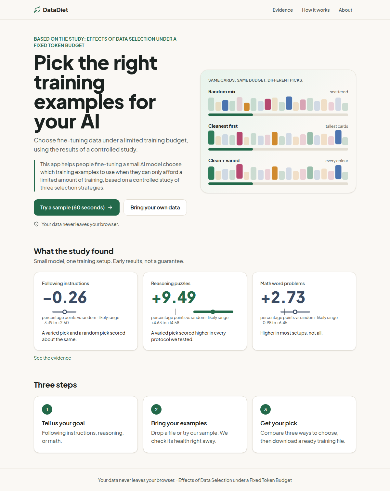
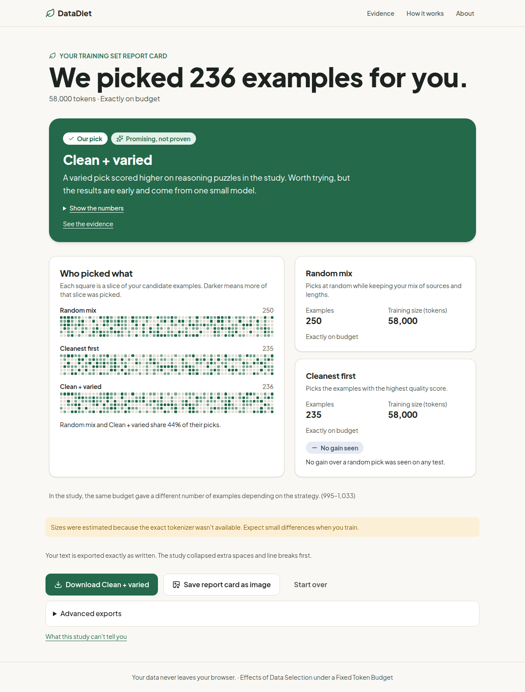
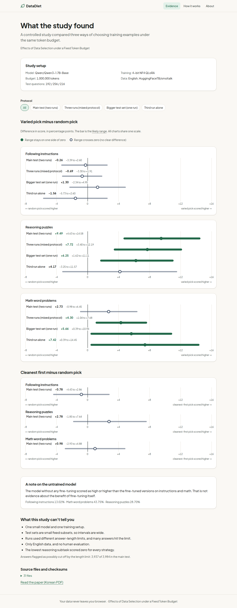
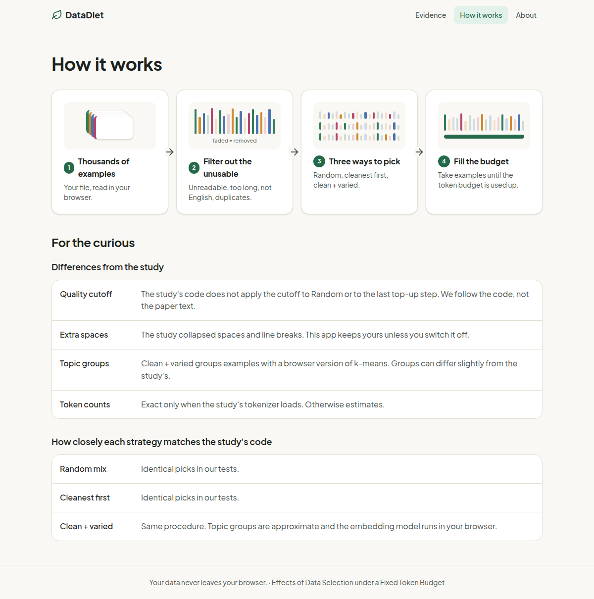

<div align="center">

# 🌿 DataDiet

**Pick the right training examples when you can only afford a little training.**

A free, in-browser tool for people fine-tuning a small AI model. It turns the results of a controlled study into a clear pick: which examples to train on, how sure we are, and a ready-to-use training file.

[**Open the app**](https://YOUR-APP.vercel.app) · [How it works](#how-it-works) · [Run it yourself](#run-it) · [The paper](public/paper/paper.pdf)



</div>

> 한국어 요약: 소형 AI 모델을 미세조정하는 사람이 학습 예산이 제한될 때 어떤 예시를 쓸지 고르도록, 논문(*Effects of Data Selection under a Fixed Token Budget*)의 세 가지 선택 전략 비교 결과를 그대로 써서 목표별 추천과 신뢰도를 알려 주고 학습용 파일을 만들어 줍니다.

---

## Who it helps

> **This app helps people fine-tuning a small AI model choose which training examples to use when they can only afford a limited amount of training, based on a controlled study of three selection strategies.**

Built on the paper *Effects of Data Selection under a Fixed Token Budget* (Korean manuscript in [`public/paper/paper.pdf`](public/paper/paper.pdf), study package in [`data/paper/`](data/paper/)). 🔒 **Your data never leaves your browser.** No account, no API key, no environment variable.

## What you do

| | Step | What happens |
|---|---|---|
| **1** | **Pick a goal** | Follow instructions · Reason through problems · Solve math word problems · Not sure |
| **2** | **Bring your examples** | Drop a `.jsonl` file (or press *Try a sample*). A data health check shows what is usable and what was skipped, and why. |
| **3** | **Get your pick** | Choose a training size. Compare **Random mix**, **Cleanest first** and **Clean + varied** on the same budget, read what the study says for your goal, and download a training file. |

<div align="center">

</div>

## What the study found

Same model, same token budget, three ways of choosing examples. Differences are **Clean + varied minus Random mix**, in percentage points, with the 95% range, on the study's main test (two training runs).

| Goal | Difference | 95% range | What DataDiet tells you |
|---|---|---|---|
| Following instructions | −0.26 | −3.39 to +2.60 | **No gain seen** |
| Math word problems | +2.73 | −0.98 to +6.45 | **Promising, not proven** |
| Reasoning puzzles | +9.49 | +4.63 to +14.58 | **Promising, not proven** |

Setup: Qwen3-1.7B-Base, 4-bit QLoRA, a 1,000,000-token budget, English data, small test subsets. One small model and one setup, so DataDiet calls even the strongest result *promising*, never proven. The numbers above are read from [`evidence.generated.json`](src/evidence/evidence.generated.json), which is built from the study's own files, and the *Evidence* page in the app shows every comparison and the limits.

<div align="center">

</div>

## How it works

1. **Read and check.** Your file is parsed in a background worker. Rows that are empty, broken, too long or duplicated are skipped, with reasons.
2. **Count tokens.** The study's tokenizer (Qwen3) is used when it can be loaded; otherwise a clearly labelled estimate.
3. **Pick three ways.** *Random mix*, *Cleanest first* and *Clean + varied* (groups clean examples by topic, then takes from every group in turn), each filled to the same budget.
4. **Read the study.** The label (*No gain seen / Promising, not proven / Unclear*) is computed from the paper's confidence intervals in [`src/evidence/recommend.ts`](src/evidence/recommend.ts).

The three strategies are a TypeScript port of the study's `select_data.py`. Random and cleanest-first picks are **identical** to the original Python on golden vectors; the varied strategy matches when the topic groups are fixed, and topic grouping (k-means) is tested statistically. Differences from the study (for example how the quality cutoff and extra whitespace are handled) are listed on the *How it works* page.

<div align="center">

</div>

## Run it

**Public URL:** [open the app](https://YOUR-APP.vercel.app) (static site, no login).

**From the ZIP** (prebuilt; needs only Python or Node):

```bash
unzip datadiet-submission.zip && cd datadiet/dist && python3 -m http.server 8080
# Windows: python -m http.server 8080      or:  npx serve dist
```

Open <http://localhost:8080>. Opening `index.html` by double-click does not work: browsers block module workers on `file://`.

**From source:**

```bash
npm install --ignore-scripts
npm run dev        # development
npm run build      # production build into dist/
npm test           # unit, parity and evidence tests
npx playwright install chromium && npm run e2e   # browser tests
```

## Quick check (about 2 minutes)

| Step | Do this | You should see |
|---|---|---|
| 1 | Open the app, read the first screen | The paper title and the one-sentence "This app helps people fine-tuning…" |
| 2 | *Try a sample* → choose **Reason through problems** | A health card: "We found N usable examples. M were skipped." with reasons |
| 3 | Continue twice (default size) | "We picked N examples for you." with a *Promising, not proven* label and three strategy cards |
| 4 | Press *Download …* | A `.jsonl` file whose line count equals N |
| 5 | Start over, choose **Follow instructions**, repeat | The label is *No gain seen* |
| 6 | Paste `hello` under *Paste text instead* | A friendly message, no crash |

*Clean + varied* downloads a small public model (about 25 MB) on first use. If it cannot be downloaded, the app says so and still shows the other two strategies.

## Data and privacy

* Everything runs in your browser. Files are never uploaded.
* `public/sample/smoltalk-sample.jsonl` is a small demo file. Regenerate a real one on your own machine:
  `pip install datasets && python tools/sample/make_sample.py --mode real --out public/sample/smoltalk-sample.jsonl`
  (streams the pinned SmolTalk revision, Apache-2.0 subsets, and adds a few synthetic "problem" rows for the health check). For a study-size test file add `--scale 20`.
* No personal data is included. Sources and licenses: see [`NOTICE`](NOTICE). Code: [MIT](LICENSE).
* Screenshots in this README were taken with demo data.

## Quality

* **Parity tests** against the unmodified Python `select_data.py` on golden vectors.
* **86 unit tests** (engine, properties, evidence, copy rules) and **22 browser tests** (full flow on a large file, determinism, cancel, bad input, privacy, accessibility, mobile width).
* Every number shown about the study comes from `evidence.generated.json`; tests check that wording never overclaims.

## Repository map

```
src/engine     selection engine (port of select_data.py)
src/ml         tokenizer, embedder, k-means
src/workers    background worker (Comlink)
src/evidence   paper numbers, recommendation rules
src/pages      screens
tests/         unit, golden-parity, property, e2e
tools/         golden generator (Python), evidence builder, sample builder, packager
data/paper     vendored study package (read-only)
docs           README screenshots
```
